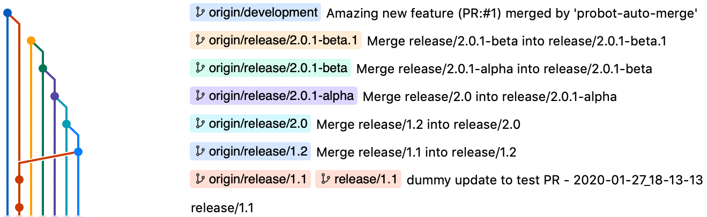
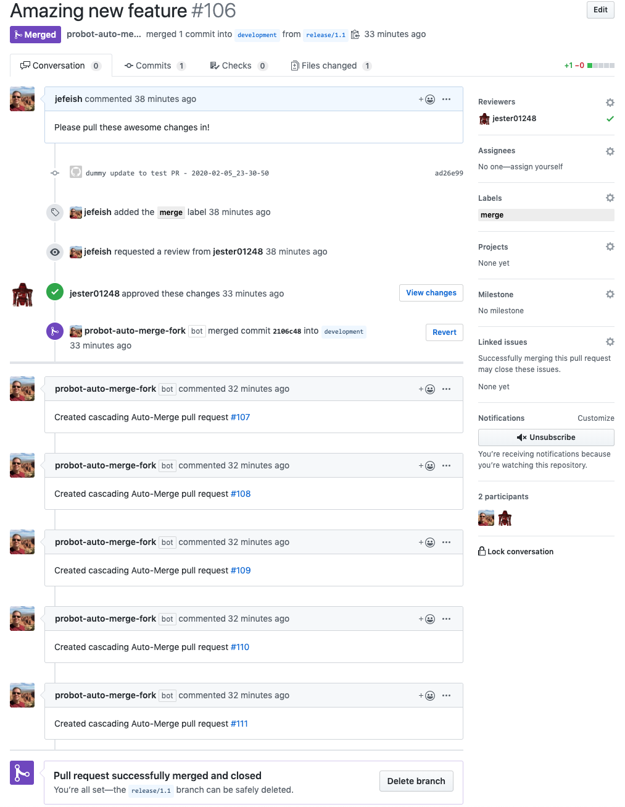

# Cascading Auto-Merge

This project is a GitHub implementation of a `Cascading Auto-Merge` feature
similar to
[Bitbuckets' Automatic branch merging](https://confluence.atlassian.com/bitbucketserver/automatic-branch-merging-776639993.html).
It auto-merges release branches based on
[semantic versioning](https://semver.org/).

The **Cascading Auto Merge** feature is applicable per repository, it can be
enabled on branch prefixes and supports semantic versioning.

## Use Case

Suppose an organization has the following release branch structure in their
Repository.

| Branches             |
| -------------------- |
| main                 |
| development          |
| release/0.1          |
| release/1.1-rc.1     |
| release/1.1          |
| release/1.2          |
| release/2.0          |
| release/2.0.1-alpha  |
| release/2.0.1-beta   |
| release/2.0.1-beta.1 |

A developer makes a change to the `release/1.1` branch and issues a pull request
(PR) against the `development` branch, requesting at least one approval. The
following should happen when the PR is approved:

1. `release/1.1` is merged into `development`
1. `release/1.1` is merged into all **subsequent** releases based on their
   semantic version

This sample output should demonstrate the expected GitHub behaviour:



In the original PR you will see comments for each subsequent cascading merge PR,
including links to these PRs, providing a full audit trail of automated merges.

Below is a sample output of a test run.



## Supported Branch Versioning

The following will give some examples on the supported semantic versions

Reference: [Semantic Versioning](https://semver.org/)

### Semantic Version Number - `MAJOR.MINOR.PATCH`

- Increment the **MAJOR** version when you make incompatible API changes
- Increment the **MINOR** version when you add functionality in a backward
  compatible manner
- Increment the **PATCH** version when you make backward compatible bugfixes

### Prerelease and Build Metadata

These are available as extensions to the `MAJOR.MINOR.PATCH` format.

| Extensions | + Version |
| ---------- | --------- |
| alpha      | alpha.1   |
| beta       | beta.1    |
| rc         | rc.1      |

### Version Syntax

`<prefix>/<MAJOR>.<MINOR>.<PATCH>-[ alpha | beta | rc ].<version>`

> The `prefix` is specific to our implementation

### Examples

In these examples we omit the prefix. In each table, rows are ordered from
oldest to newest.

#### Standard Versioning

| Example |
| ------- |
| 1.1.0   |
| 1.1.2   |
| 1.2.0   |
| 1.2.1   |
| 1.3.0   |
| 2.0.0   |

#### Prerelease Versioning

| Example       |
| ------------- |
| 1.0.0-alpha   |
| 1.0.0-alpha.1 |
| 1.0.0-beta    |
| 1.0.0-beta.2  |
| 1.0.0-beta.11 |
| 1.0.0-rc.1    |
| 1.0.0         |

### Branch Naming Examples

- `release/1.1.0`
- `release/1.2.0-beta`
- `feature/1.1.0-alpha.1`

## Action Configuration

### Allow GitHub Actions to Create Pull Requests

In the admin permissions for the organization or repository enable the option to
[allow GitHub Actions to create and approve pull requests](https://docs.github.com/en/repositories/managing-your-repositorys-settings-and-features/enabling-features-for-your-repository/managing-github-actions-settings-for-a-repository#preventing-github-actions-from-creating-or-approving-pull-requests).

This is needed in order to allow the GitHub Action to create and open the PRs.

### Disable the Automatic Branch Deletion

The action relies on the branch that opens the PR to remain in place so that the
subsequent merges can still occur. The option to
[automatically delete head branches](https://docs.github.com/en/repositories/configuring-branches-and-merges-in-your-repository/configuring-pull-request-merges/managing-the-automatic-deletion-of-branches)
must be deselected in order for the action to work properly.

### Example Workflow

```yaml
---
name: Automatic Branch Merging

on:
  pull_request:
    types:
      - closed

permissions:
  contents: write
  pull-requests: write
  issues: write

jobs:
  merge:
    name: Cascading Auto Merge
    runs-on: ubuntu-latest

    if: |
      github.event.pull_request.merged == true &&
      startsWith(github.head_ref, 'release/')

    steps:
      - name: Automatic Merge
        uses: ActionsDesk/cascading-downstream-merge@vX.Y.Z # Replace with the latest version
        with:
          github_token: ${{ secrets.GITHUB_TOKEN }}
          prefixes: release/
          refBranch: development
```

### Protected Branches

There are cases where you may want to use branch protection on branches where
you also need to use this action. In those cases you'll need to use an
additional secret named `MERGE_TOKEN` that has elevated access to the
repository. The pre-existing `GITHUB_TOKEN` provided by GitHub Actions will not
be able to bypass the branch protection.

Therefore you'll need to create a
[Machine User](https://docs.github.com/en/developers/overview/managing-deploy-keys#machine-users)
with Admin access or a
[custom GitHub App](https://docs.github.com/en/developers/apps/building-github-apps/creating-a-github-app)
that only needs read/write for the contents permissions. Than either of these
can be used in the selected option to
[allow specified actors to bypass required pull requests](https://github.blog/changelog/2021-11-19-allow-bypassing-required-pull-requests/).

```yml
name: Automatic Branch Merging

on:
  pull_request:
    types:
      - closed

permissions:
  contents: write
  pull-requests: write
  issues: write

jobs:
  merge:
    name: Cascading Auto Merge
    runs-on: ubuntu-latest

    if: |
      github.event.pull_request.merged == true &&
      startsWith(github.head_ref, 'release/')

    steps:
      - name: Get GitHub App Token
        id: token
        uses: actions/create-github-app-token@v1
        with:
          app-id: ${{ secrets.CUSTOM_APP_ID }}
          private-key: ${{ secrets.CUSTOM_APP_PEM_FILE }}
          owner: ${{ github.repository_owner }}

      - name: Automatic Merge
        uses: ActionsDesk/cascading-downstream-merge@vX.Y.Z # Replace with the latest version
        with:
          github_token: ${{ secrets.GITHUB_TOKEN }}
          merge_token: ${{ steps.token.outputs.token }}
          prefixes: release/
          refBranch: development
```
